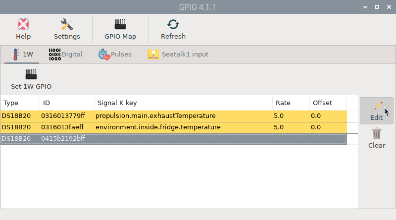

# 1-Wire - sensors

1-Wire sensors like the DS18B20 are digital sensors specially designed to measure temperature in extreme conditions. That makes them perfect for your engine or fridge. Because they are digital, you do not get any signal degradation even over long distances (30-40 meters). You can connect multiple sensors to the same connector because each one has a unique 64-bit ID burned in at the factory to differentiate them.

## Wiring

!!! important
    Always follow our [safety](index.md#safety) tips before making any connection.

The MacArthur HAT includes a 1.6K pull-up resistor for this connector, so all you have to do is screw the wires into their correct place. 

The color of the wires of these sensors are usually the same, yellow for **data**, red for **power** and black for **ground**. You may also find a white wire that you can ignore.

## Configuration

After wiring, you can identify your sensors and assign them to a Signal K key using the  *GPIO* app.  First you need to enable the 1-Wire interface in Raspberry OS. Go to *Preferences – Raspberry Pi configuration – Interfaces*, enable the *1-Wire* slider and click **OK**. 

After rebooting you may get an error at startup warning you about a conflict in *GPIO - 1W*. This means that by default the 1-Wire interface is set to GPIO 4 and you may already be using that GPIO (usually for UART). Do not worry, in the next step we will configure the GPIO used by the MacArthur HAT for 1-Wire and the conflict will be resolved.

Go to the  *GPIO* app,  **1W** tab and click  **Set 1W GPIO**. Select *GPIO 19* and click **OK**. After reboot, the conflict will be resolved, and we should get the list of connected sensors when we go back to the  *GPIO* app.

Select one of the detected sensors and click  **Edit**. Type or select a *Signal K key*, select the sample rate, set an *Offset* if you need it and click **OK**. You should start receiving data on the Signal K server for those keys. Remember that the temperature on the Signal K server is always displayed in Kelvin.

