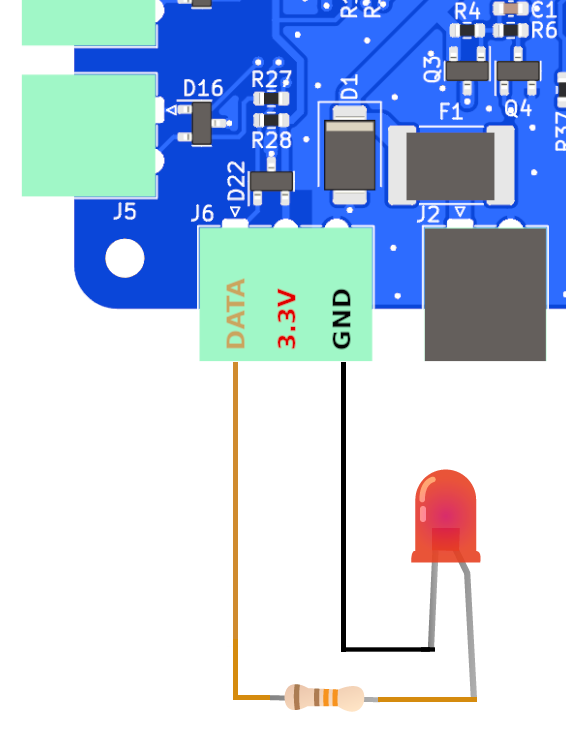

# 1-Wire - alternative uses

This connector basically consists of a 1.6K pull-up resistor connected to the GPIO 19 of the Raspberry Pi, so you can configure this GPIO as an input and connect any switch or any digital sensor such as float switches, door detectors, motion sensors… You can also configure this connector as an output and activate low power external devices such as LEDs, relays, buzzers…

!!! warning ""

    { align=left } If you supply this connector or any GPIO in the header with more than 3.3V you will damage the Raspberry Pi. Do not connect high consumption devices such as motors either.

## Input

!!! important
    Always follow our [safety](index.md#safety) tips before making any connection.

By connecting a switch as shown in the image above, GPIO 19 will go **high** when the switch is **open** and **low** when the switch is **closed**.

After wiring, go to the  *GPIO*,  **Digital** tab and click  **Add input**. Select **GPIO 19** in *GPIO* field and **none** in *internal pull resistor* field. Select a **state** and write a *message* for each of the possible *high* or *low* states. Finally select **visual** in *method* and click **OK** to check the operation of the switch.

In addition to visual and sound warnings, you can use the  *Notifications* app to assign  **Actions** to each of the defined states for the Signal K key “notifications.GPIO19”.

  
Visual warning

## Output

Depending on how you connect the external device, in this case a LED, it will behave differently. To treat this connection as a digital output you have to go to the  *GPIO* app,  **Digital** tab and click  **Add output**. Select **GPIO 19** in *GPIO* field and automatically two new  **Actions** will we created in the  *Notifications* app to set high (3.3V) or low (0V) the GPIO 19.

  
*New actions in Notifications app*

### Wiring options

!!! important
    Always follow our [safety](index.md#safety) tips before making any connection.

When the external device is connected to **DATA** and **GND**, GPIO 19 will be high and the LED will turn on at startup (~3.3V). When you run the action ***GPIO19: turn it high***, the LED will turn on (3.3V). When you run the action **GPIO19: turn it low**, the LED will turn off (~0V).

!!! important
    Always follow our [safety](index.md#safety) tips before making any connection.

When the external device is connected to **DATA** and **3.3V**, GPIO 19 will be low and the LED will stay off at startup (~0V). When you run the action ***GPIO19: turn it high***, the LED will turn off (0V). When you run the action ***GPIO19: turn it low***, the LED will turn on (~3.3V).