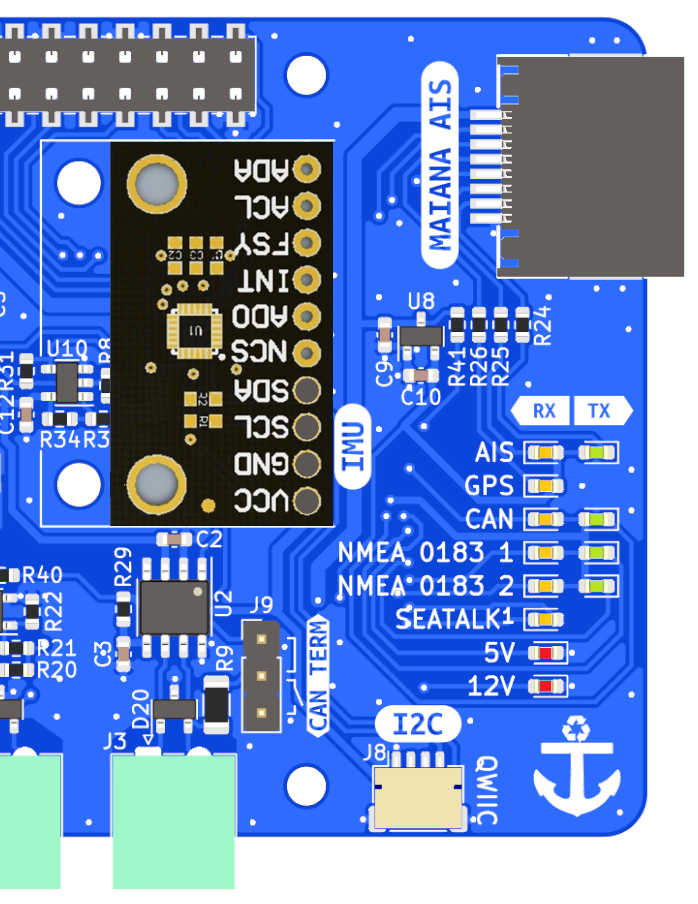
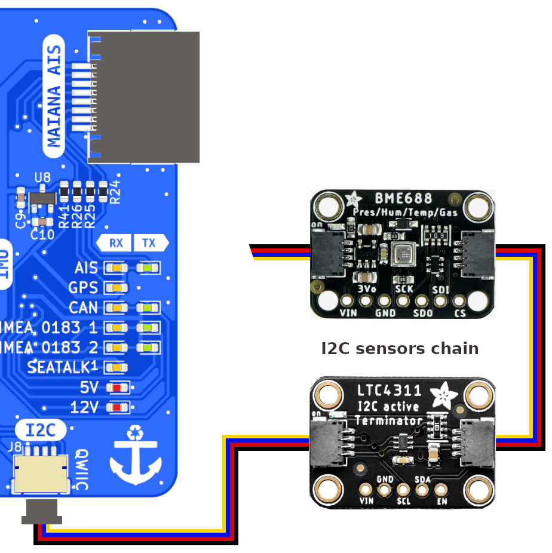

# I2C sensors

I2C digital sensors are perfect for collecting data on multiple environmental parameters such as temperature, pressure, humidity, air quality or presence of gases, light intensity, etc. and orientation parameters such as heading, heel and trim. You can also use sensors to measure the voltage and current of your batteries or analog-to-digital converters to be able to use any analog sensors and infinitely expand the list of parameters to be measured.

There are two ways to connect I2C sensors to the MacArthur HAT, externally via STEMMA QT/Qwiic connectors or internally via a female socket on the board, each one has its disadvantages and advantages. 

## Internal

!!! important
    Always follow our [safety](index.md#safety) tips before making any connection.

The internally mounted sensors are compact and very easy to install but they are affected by the temperature of the Raspberry and make it impossible to read some parameters such as pressure when our system is inside a sealed box. Maybe it would not be the perfect place for environment sensors, but it is the perfect place for an IMU sensor and get heading, heel and trim as shown in the image above.

## External

!!! important
    Always follow our [safety](index.md#safety) tips before making any connection.

Externally mounted sensors will be less affected by other devices since we can move them away. We can also connect multiple sensors in line to the same bus. However, the I2C bus is not designed to support long distances and we will start getting invalid readings when the cable we use is longer than one meter. If you need long distances, you must add an I2C amplifier like the LTC4311 module as shown in the image on the right. By connecting the amplifier at the beginning of the sensors chain, you can get up to 30 meters at the default frequency using quality cables.

## Configuration

I2C sensors are configured using the  *I2C* app. Learn more about supported I2C sensors and their configuration in the [OpenPlotter manuals](https://openplotter.readthedocs.io/latest/i2c/i2c_app.html). IMU sensors for heading, trim and heel are an exception and are configured using the  *Pypilot* app, learn more about it in the [OpenPlotter manual](https://openplotter.readthedocs.io/latest/pypilot/pypilot_app.html).