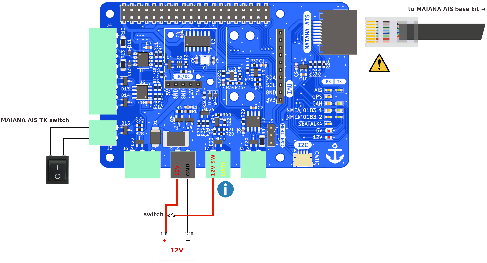

# MAIANA AIS

You can connect a MAIANA AIS base kit directly to the MacArthur HAT using a Cat5 cable (Ethernet cable with RJ45 connectors). The HAT has the same features as all MAIANA AIS adapters together. You can receive AIS and GNSS data and configure the MAIANA transponder in OpenPlotter through the UART0 interface. You can also send NMEA 0183, NMEA 2000 or Signal K data to any device on your boat.

## Wiring

!!! important
    Always follow our [safety](index.md#safety) tips before making any connection.

!!! warning ""

    { align=left } Do not connect any device other than the MAIANA base kit. Confusing this RJ45 connector with the RJ45 connector of the Raspberry Pi can cause damage to both devices.

!!! note ""

    { align=left }  12V SW must be connected for the MAIANA base kit to work.

You do not need the power module to make the MAIANA AIS work, but you need to power the MAIANA AIS with 12V as shown in the image above. Of course, MAIANA AIS will also work when the power module is present.

There are times when you are not interested in sharing your position. To turn the AIS data transmission off quickly, the HAT has a connector for you to add a switch. MAIANA AIS has two switches for transmission, a *software TX switch*, and this *hardware TX switch*. Both switches must be on to transmit AIS data. When this physical switch is open, the *hardware TX switch is on*, when it is closed, the *hardware TX switch* is off.

## Configuration

To configure the MAIANA AIS, follow the steps in the [OpenPlotter manual](https://openplotter.readthedocs.io/latest/maiana/configuring.html). Remember that when using the MacArthur HAT, the MAIANA AIS connects via UART0.

## LEDs

□ off | ■■■ blinking |  ▬▬ fixed

|LED|RX|TX|Description|
|:--:|:--:|:--:|:---|
| AIS | □ |  | MAIANA AIS is not connected or is not receiving GNSS or AIS data |
| AIS |■■■|  | MAIANA AIS is receiving AIS data from ships around you |
| AIS |  | □ | The hardware or software TX switch is off and there is no AIS transmission|
| AIS | | ▬▬| The hardware and software TX switches are on and there is AIS transmission |
| GPS | □ |  | There is not GPS fix yet |
| GPS | ▬▬ |  | There is GPS fix |