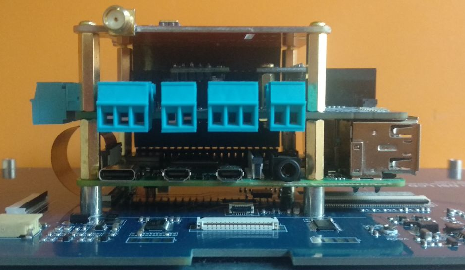
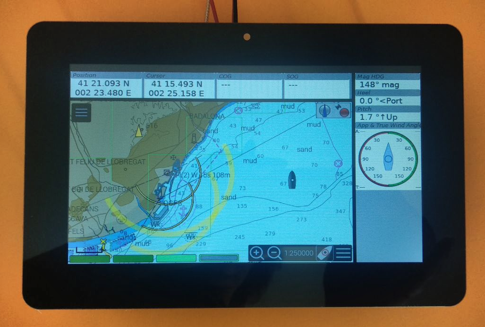
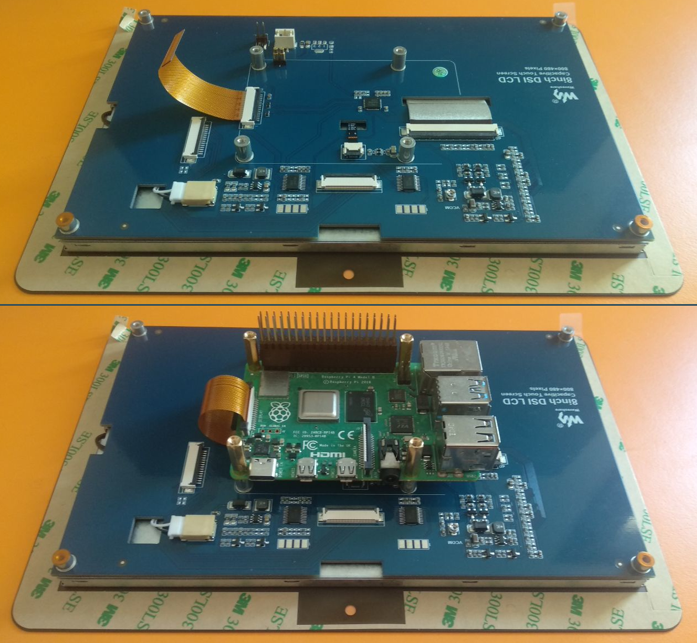
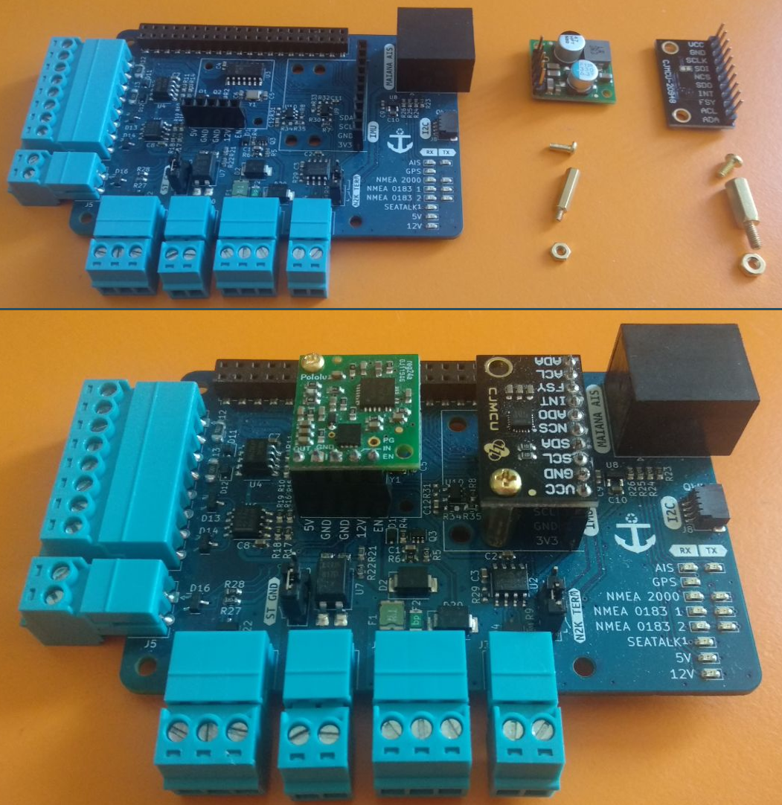
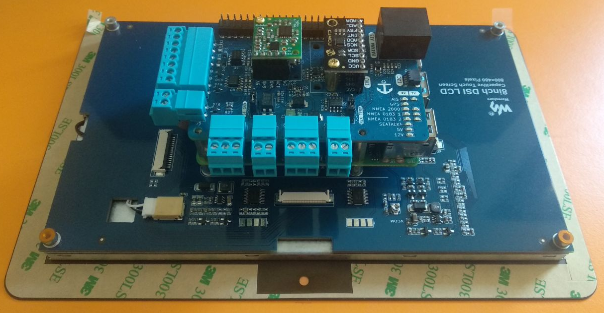
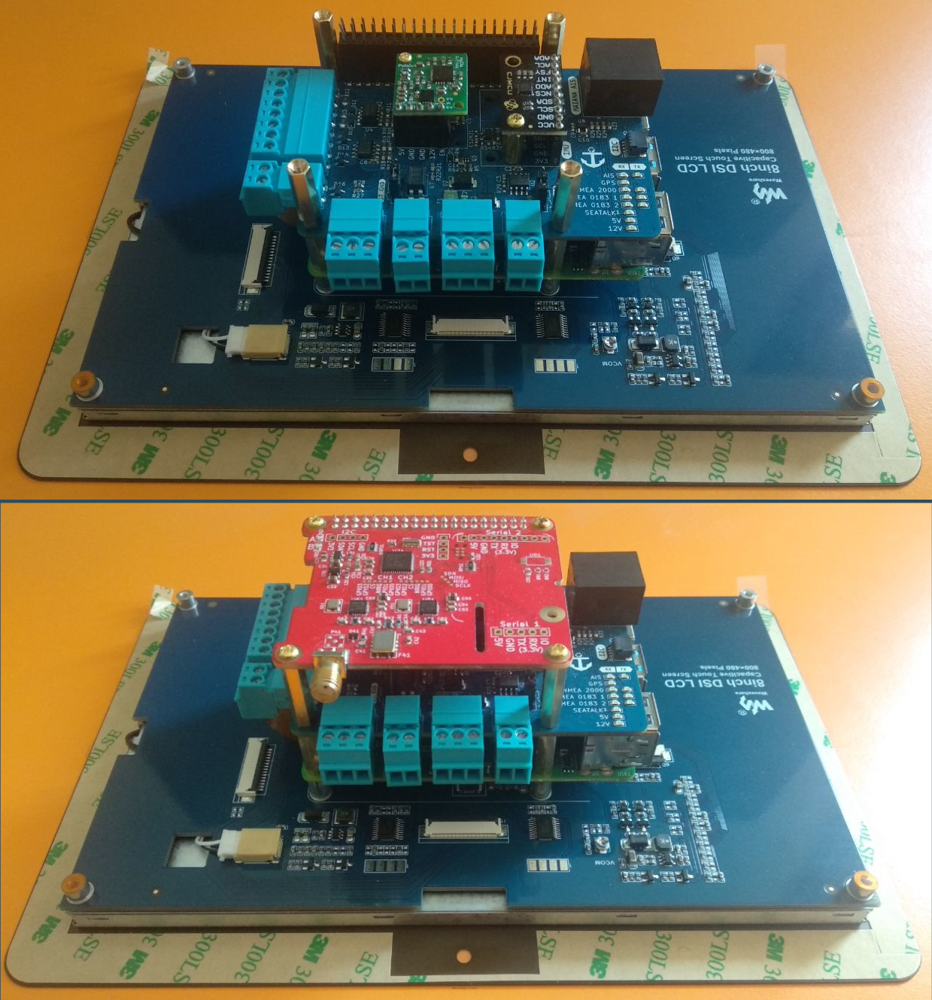

# Mounting the HAT

!!! warning
	This chapter shows how to mount the MacArthur HAT directly on a Raspberry Pi. If you plan to use a cable, extension board or non-standard case, verify the pinout of the connector before mounting the MacArthur HAT. Connecting the MacArthur HAT in the wrong orientation may permanently damage the MacArthur HAT and/or the Raspberry Pi.

## Ground floor

The MacArthur HAT is designed to work in conjunction with other boards. In this example, we are going to build a compact 5-floor system with a dAISy HAT on the top floor and an 8-inch touch screen on the ground floor to be installed on a panel inside the boat.

The touch screen is powered from the Raspberry Pi which is powered by the MacArthur HAT power module making installation much simpler. The possibilities are endless and instead of using a touch screen as a ground floor, you could also put the whole set in a sealed electrical box and connect an HDMI monitor.

## First floor

Screw the Raspberry Pi to the touch screen pillars using the 4x supplied 16mm M2.5 standoffs. Also plug in the extra-long stacking header extender provided.

Do not forget to connect the 15PIN FPC cable to the DSI interface of the Raspberry Pi for video and touch screen data.

## Third floor

Before adding the second floor to the set we need to add the third floor, which in this case refers to the power module and an internal I2C module with an IMU.

Both modules need to be secured in at least one corner. The power module is supplied with 2x 11mm standoffs and 2x M2 screws and nuts. The I2C module needs 2x 11mm standoffs and 2x M2.5 screws and nuts which are also provided.

## Second floor

Now we can add the second and third floor to the set. The GPIO header extender pins should stick out enough to connect another HAT or access the pins individually.

If you are not going to connect another HAT, you can now secure the MacArthur HAT with the 4x supplied M2.5 screws.

## Fourth floor

If we want to connect another HAT, we must use the extra GPIO header extender of normal size and the 4x spacers of 20mm and M2.5 also provided. Finally, we will secure the dAISy HAT with 4x M2.5 screws.

