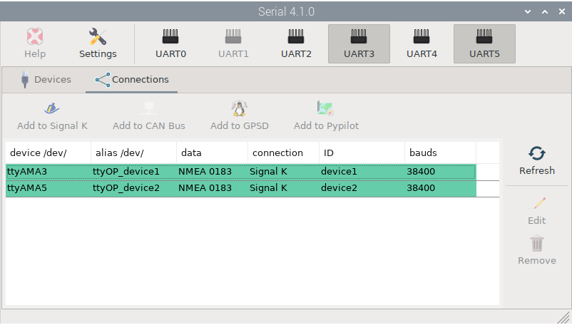

# NMEA 0183

Most GNSS, AIS or autopilot devices still accept this old protocol, so we can say that it will be on our boats for a long time. The MacArthur HAT can send and receive NMEA 0183 data from two devices at the same time, but it can also communicate with a total of four devices if they are only sending or receiving data.

## Wiring

!!! important
    Always follow our [safety](index.md#safety) tips before making any connection.
    
Your NMEA 0183 device usually will have four connections: TX+, TX-, RX+, RX-. TX means *transmit* and RX means *receive*.

You have to connect the TX connectors of your device to the RX connectors of the MacArthur HAT and the RX connectors of your device to the TX connectors of the MacArthur HAT. However, there is little consistency between devices as to what is positive and what is negative, so if the connection between TX and RX connectors with the same sign does not work, try connecting opposite signs. Do not worry, you will not damage the device or the MacArthur HAT by reversing the polarity.

## Configuration

In order to send and receive data via TX/RX 1 and TX/RX 2, we must first enable the UART3 and UART5 serial interfaces respectively in OpenPlotter. We can easily do this using the *Serial app*. Click the **UART3** and **UART5** buttons and reboot. After booting you should see two new items in the list of detected serial devices. Select the first one, provide an *alias*, for example *device1*, and select *NMEA 0183* under *data*. Click **Apply** and repeat the process for the second device. Then go to the **Connections** tab, select the first item, and click the **Add to Signal K** button. In the next window, select the *Baud Rate* of your device and click **AUTO**. Repeat the process with the second item and from then on you are ready to get NMEA 0183 data to the Signal K server from both devices (RX 1 and RX 2).

To send data through TX 1 and TX 2 we need to use Signal K events. For example, if we wanted to relay to TX 2 all the data coming in through RX 1, we would need to edit the connection for *device1* in the Signal K server and add an event name in the *Input Event* field, for example *RX1input*. Finally, we need to edit the connection for *device2* and add the *RX1input* event in the *Output Events* field. After editing both connections, restart the Signal K server and data coming in from *device1* will start flowing to *device2*. To learn more about Signal K events, read the *NMEA 0183 Multiplexing* chapter in the [OpenPlotter manual](https://openplotter.readthedocs.io/en/latest/signalk/multiplexing.html).

## LEDs

□ off | ■■■ blinking |  ▬▬ fixed

|LED|RX|TX|Description|
|:--:|:--:|:--:|:---|
| NMEA 0183 1/2 | □ | |The device is not connected or is not sending us data|
| NMEA 0183 1/2 |▬▬| |The device is connected but you should probably try reversing polarity|
| NMEA 0183 1/2 |■■■| |The device is connected and is sending us data|
| NMEA 0183 1/2 | | □ |OpenPlotter is not yet configured to send data or there is nothing to send|
| NMEA 0183 1/2 | |■■■|OpenPlotter is configured and sending data to the device|   