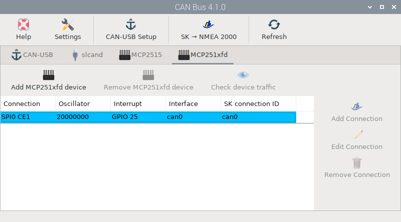

# NMEA 2000

Raymarine SeaTalk2, Raymarine SeaTalkNG, Simrad Simnet and Furuno CAN are rebranded implementations of NMEA 2000, but they use physical connectors different from the standardised DeviceNet 5-pin A-coded M12 screw connector. This is intentional to keep you tied to a brand, but they are all electrically compatible. Cables that convert exclusive formats to the standard NMEA 2000 format are extremely expensive. Using simply screw connectors we make the MacArthur HAT easy to connect to all brands by simply cutting any of the cables used in their drop lines and connecting the **CAN-H**, **CAN-L** and **V+** wires.

The image below shows the pinout of the standard NMEA 2000 connectors and the colors of the wires, but each brand will have different pinout and colors. To identify the CAN-H, CAN-L, V+ and V- wires of our drop line we must consult the documentation of the device or ask the manufacturer.

NMEA 2000 networks must have **a terminator at each end**. Without these terminators there will be no reliable data traffic, so the MacArthur HAT has an optional termination resistor in case one of the network terminators is missing or you are connecting the HAT directly to another NMEA 2000 device. If your network is correctly terminated, the **N2K TERM** jumper must be in the **open** position. If termination is missing in your network, the N2K TERM jumper must be in the closed position.

!!! warning ""

    { align=left } The MacArthur HAT NMEA 2000 circuit is not electrically isolated but you should have no problems as long as the Raspberry Pi and the NMEA 2000 network are powered from the same source.

## Wiring with power module in integrated mode

!!! note ""

    { align=left }  12V SW must be connected for the power module to turn on.

To integrate your system into your NMEA 2000 network and have it act like any other device, you must wire it as you can see in the image above.

If you open the **main switch**, all the devices on the NMEA 2000 network will turn off (plotter, sensors, displays...) but OpenPlotter will stay on until the system shuts down safely and finally turns off by itself.

## Wiring with power module in standalone mode

!!! note ""

    { align=left }  12V SW must be connected for the power module to turn on.

There are some cases where you may want to keep your Raspberry Pi on and your boat's electronics off. For example, when you are in port and you do not need navigation instruments but you want to remotely control your boat while you are away using sensors and alarms defined in OpenPlotter. In that case you have to wire it as you can see in the image above.

If you open the **main switch**, all the devices on the NMEA 2000 network will turn off (plotter, sensors, displays...) but OpenPlotter will stay on until you open the **Raspberry Pi switch** and the system shuts down safely and finally turns off by itself .

## Wiring without power module

If you are not using the power module you have to wire it as you can see in the image above.

If you open the **main switch**, all the devices on the NMEA 2000 network will turn off (plotter, sensors, displays...) but OpenPlotter will stay on until you manually shut down the system and turn off the Raspberry Pi 5V power supply.

## Tips to design your NMEA 2000 network

* The CAN bus should be powered directly from the battery.
* Any multifunction display (aka MFD or Plotter) should never be powered from the CAN bus, it should have its own power line from the battery. This includes the Raspberry Pi.
* Only small displays or low-power devices should be powered from the CAN bus.
* The 2 terminators resistors must always be present on the CAN bus. You can replace one of them (or two) with the internal terminators resistors of a device if it is present, but only if this device is at the end or start of the line. The MacArthur HAT has a terminators resistor to do this.
* Follow this procedure to check the terminators resistors: with power off measure resistance between CAN-H and CAN-L. Resistance should be 60 ohms if both terminators resistors are present. If measurement is 120 ohms only one terminators resistor is present. If 40 ohms is measured a third terminators resistor is installed and should be removed. Some CAN devices may have an internal terminators resistor that is switched by software once the unit is powered up, in these instances, it cannot be detected by measuring resistance, consult manufactures literature to determine if this is the case. If less than 40 ohms is measured there could be a short in the lines or a damaged CAN port of one of the devices connected to the network.

## Configuration

Once the MacArthur HAT is connected to the NMEA 2000 network we need to configure OpenPlotter to receive and send data. Open the *CAN Bus* app and go to the **MCP251xfd** tab:

Click **Add MCP251xfd device** and select *SPI0 CE1* as *Interface*, *20000000* as *Oscillator*, *GPIO 25* as *Interrupt* and click **OK**.

After rebooting OpenPlotter, go back to the *CAN Bus* app at **MCP251xfd** tab, select the new entry in the device list and click **Add Connection** to create a connection to the Signal K server. The Signal K server will restart, and you should start receiving data from the NMEA 2000 network.

To send data from the Signal K server to the NMEA 2000 network follow the steps in the [OpenPlotter manual](https://openplotter.readthedocs.io/en/3.x.x/can/output.html).

## LEDs

□ off | ■■■ blinking |  ▬▬ fixed

|LED|RX|TX|Description|
|:--:|:--:|:--:|:---|
| NMEA 2000 | □ | □ |OpenPlotter is not configured and the HAT is not connected to the CAN bus|
| NMEA 2000 |▬▬|▬▬|OpenPlotter is configured but the HAT is not connected to the CAN bus|
| NMEA 2000 |▬▬| □ |OpenPlotter is not configured but the HAT is connected to the CAN bus|
| NMEA 2000 | ■■■ | □ |OpenPlotter is configured, the HAT is connected to the CAN bus and is receiving data|
| NMEA 2000 |■■■|■■■|OpenPlotter is configured, the HAT is connected to the CAN bus and is sending data (when data is sent the 2 LEDs blink at the same time)|   