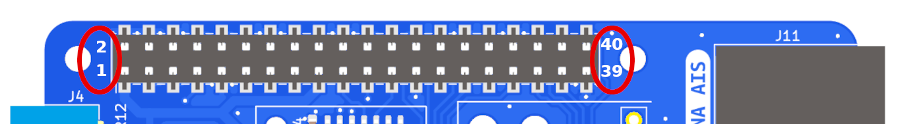

# Header pinout

* All pins can be accessed by other HATs with a stacking header.

* The MacArthur HAT uses the red pins , which can also be used by other HATs but only one at a time.

* The MacArthur HAT uses the green pins, which can also be used by other HATs at the same time.

* The MacArthur HAT does not use the black pins.

| Feature | Interface | BCM | Pins | BCM | Interface | Feature |
|:-------:|:---------:|:---:|:----:|:---:|:---------:|:-------:|
|  |  | 3.3V | 1 - 2 | 5V |  |  |
| I2C sensors compass, heel, trim | I2C SDA | GPIO2 | 3 - 4 | 5V |  |  |
| I2C sensors compass, heel, trim| I2C SCL | GPIO3 | 5 - 6 | GND |  |  |
| NMEA 0183 TX1* | UART3 TX | GPIO4 | 7 - 8 | GPIO14 | UART0 TX | MAIANA AIS dAISy HAT Pypilot controller|
| | | GND | 9 - 10 | GPIO15 | UART0 RX | MAIANA AIS dAISy HAT Pypilot controller|
| | | GPIO17 | 11 - 12 | GPIO18 | | |
| | | GPIO27 | 13 - 14 | GND | | |
| | | GPIO22 | 15 - 16 | GPIO23 | | |
| | | 3.3V | 17 - 18 | GPIO24 | | |
| NMEA 2000 | SPI0 MOSI | GPIO10 | 19 - 20 | GND | | |
| NMEA 2000 | SPI0 MISO| GPIO9 | 21 - 22 | GPIO25 | GPIO | NMEA 2000 INT |
| NMEA 2000 | SPI0 SCLK| GPIO11 | 23 - 24 | GPIO8 | | |
| | | GND | 25 - 26 | GPIO7 | SPI0 CE1 | NMEA 2000 CS |
| | | GPIO0 | 27 - 28 | GPIO1 | |  |
| NMEA 0183 RX1* | UART3 RX| GPIO5 | 29 - 30 | GND | | |
| | | GPIO6 | 31 - 32 | GPIO12 | UART5 TX | NMEA 0183 TX2* |
| NMEA 0183 RX2* | UART5 RX| GPIO13 | 33 - 34 | GND | | |
| 1-Wire sensors GPIO | 1W/GPIO| GPIO19 | 35 - 36 | GPIO16 | | |
| Power Off | GPIO| GPIO26 | 37 - 38 | GPIO20 | GPIO | Seatalk1  RX GPIO |
| | | GND | 39 - 40 | GPIO21 | GPIO | Shutdown |

*If you want to use these GPIOs for other purposes, note that they all have pull-up resistors.