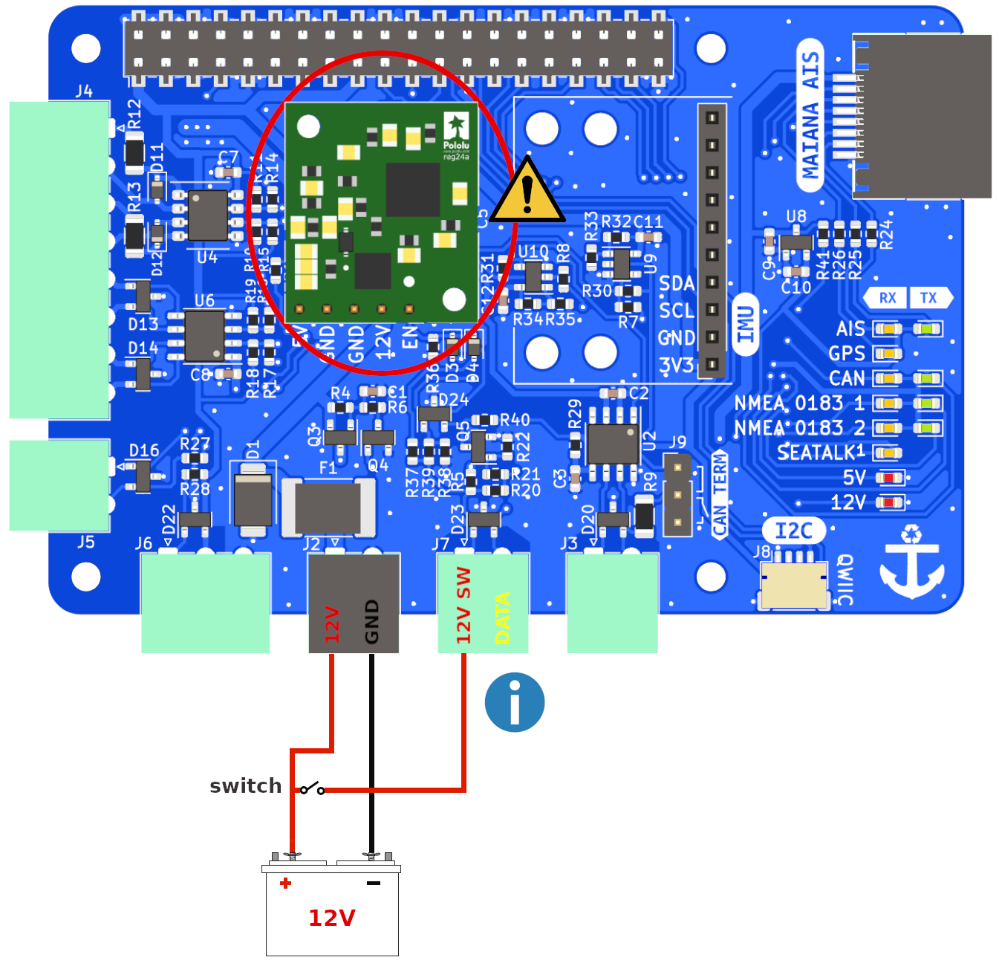
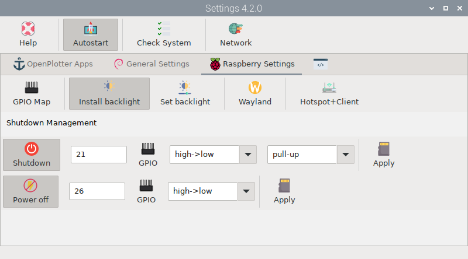

# Power management

This feature is optional, so you can also use all features of the MacArthur HAT by powering the Raspberry Pi using a 5V power supply as usual. On the other hand, if you choose to power the system from the MacArthur HAT, you will need to mount the power module which will also provide some extra functionality.

One of the main problems with Raspberry Pi based systems is the corruption of SD cards due to power outages. We often turn off the power to our on-board electronics without remembering to shut down the Raspberry Pi OS and the consequences can be critical. There are currently several solutions based on supercapacitors or HATs with its own battery that detect power outages and automatically shut down the system, but they also have their drawbacks. Often the system takes too long to close some programs and needs more time than supercapacitors can offer. And solutions based on extra batteries add unnecessary complexity, why use an extra battery just to keep the system on until it shuts down when we can use our boat's?

## Wiring with power module

!!! warning ""

    { align=left } Do not power the Raspberry Pi using the USB-C power supply (5V) and the MacArthur HAT power module (12V) at the same time.

!!! note ""

    { align=left } 12V SW must be connected for the power module to turn on.

After the software configuration just close the main switch to start OpenPlotter and open the main switch to shutdown OpenPlotter cleanly no matter how much time the system needs. When the power module cuts the current, it is still connected to the battery, but the consumption is only 0.1 mA.

If you want to integrate OpenPlotter into your NMEA 2000 or Seatalk1 network using the MacArthur HAT, read the corresponding chapters to learn how to wire correctly.

## Configuration

When the external switch is turned off, the MacArthur HAT tells OpenPlotter via a GPIO that it must initiate the shutdown immediately. OpenPlotter will use another GPIO to tell the HAT when the shutdown is complete so that the HAT can cut power to the Raspberry Pi. From that moment on, the HAT keeps listening to the external switch and when it is turned on it provides power to the Raspberry Pi again, starting OpenPlotter.

We need to define in OpenPlotter which GPIOs are going to perform these tasks and we can do this easily using the *Settings* application:

## LEDs

□ off | ■■■ blinking |  ▬▬ fixed

|LED|RX|TX|Description|
|:--:|:--:|:--:|:---|
| 5V | □ |  | The power module is not present or there is no 12V input yet |
| 5V |▬▬|  | The power module is present and is powering the Raspberry Pi |
| 12V | □ |  | There is no 12V SW input |
| 12V |▬▬|  | There is 12V SW input |