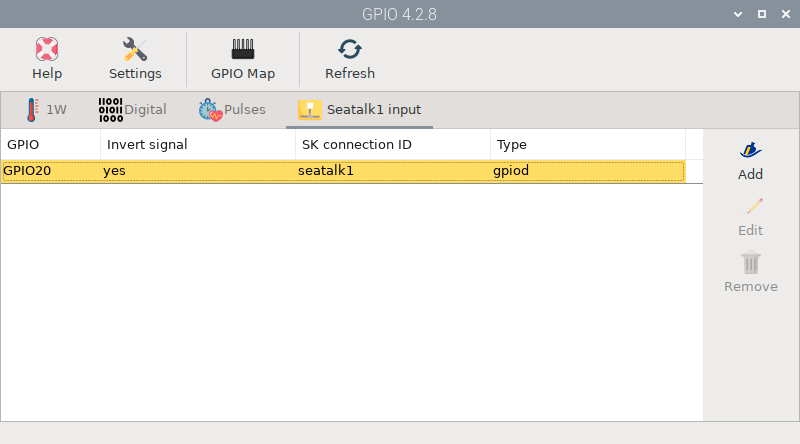

# Seatalk1 input

Seatalk1 is an old and outdated communication protocol, but it is still quite present on many boats. The Seatalk1 bus has 3 wires: **black** for GND, **yellow** for data, and **red** for power.

## Wiring with power module

!!! note ""

    { align=left }  12V SW must be connected for the power module to turn on.

You need to connect **yellow** wire to **DATA** connector and **red** wire to **12V SW** connector.

When using the power module, if you open the **main switch**, all the devices on the Seatalk1 bus will turn off (plotter, sensors, displays...) but OpenPlotter will stay on until the system shuts down safely and finally turns off by itself.

## Wiring without power module

If you are not using the power module, you will need to connect **yellow** wire to **DATA** connector, **red** wire to **12V SW** connector and also **black** wire to **GND** connector.

If you open the **main switch**, all the devices on the Seatalk1 bus will turn off (plotter, sensors, displays...) but OpenPlotter will stay on until you manually shut down the system and turn off the Raspberry Pi 5V power supply.

## Configuration

To receive data via Seatalk1 you need the *GPIO app*. Go to the **Seatalk1 input** tab and click **Add**. Provide an ID for this connection, e.g. seatalk1, select the *GPIO 20*, check *Invert signal* and click **OK**.

The Signal K server will restart, and you should start receiving data from the Seatalk1 bus.

## LEDs

□ off | ■■■ blinking |  ▬▬ fixed

|LED|RX|TX|Description|
|:--:|:--:|:--:|:---|
| Seatalk1  | □ |  |Seatalk1 wires are not connected or there is no data traffic.|
| Seatalk1  |■■■|  |Seatalk1 wires are connected and there is data traffic.|