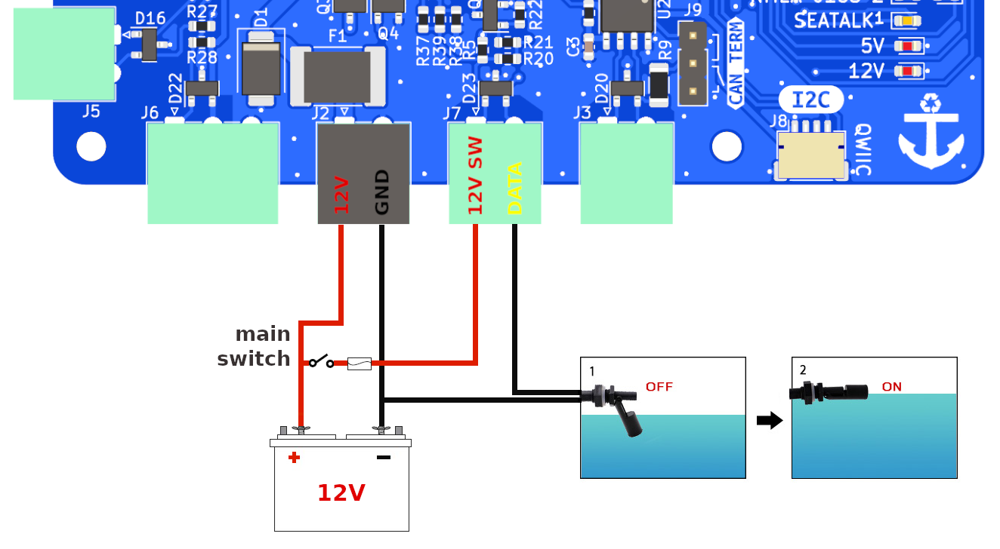

# Seatalk1 - alternative uses

If you do not have a Seatalk1 network you can also use this connector to detect the status of some sensors using up to 12V without damaging the Raspberry.

One of the applications could be to measure the engine RPM by connecting the 'W' terminal or tachometer signal wire. This would be configured in the **Pulses** tab of the *GPIO app*.

Another application could be to detect when a reed switch has been activated. In the following example you can see how to connect a float switch to detect the liquid level of a tank or bilge. After wiring as below picture, go to the *GPIO app*, **Digital** tab and click **Add input**. Select **GPIO 20** in *GPIO* field and **none** in *internal pull resistor* field. Select a **state** and write a *message* for each of the possible *high* or *low* states. Finally select **visual** in *method* and click **OK** to check the operation of the detector. In addition to visual and sound warnings, you can use the *Notifications app* to assign **Actions** to each of the defined states for the Signal K key “notifications.GPIO20”.

## LEDs

□ off | ■■■ blinking |  ▬▬ fixed

|LED|RX|TX|Description|
|:--:|:--:|:--:|:---|
| Seatalk1  | □ |  |Input is low.|
| Seatalk1  |▬▬|  |Input is high.|